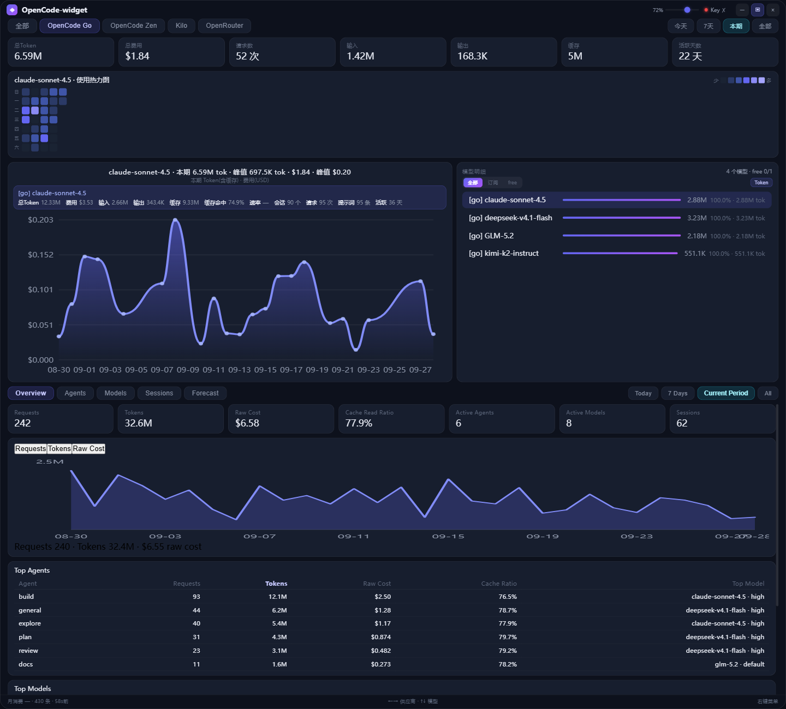
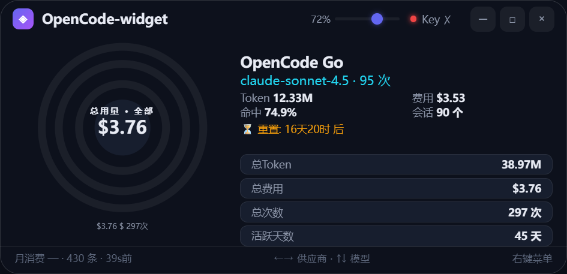
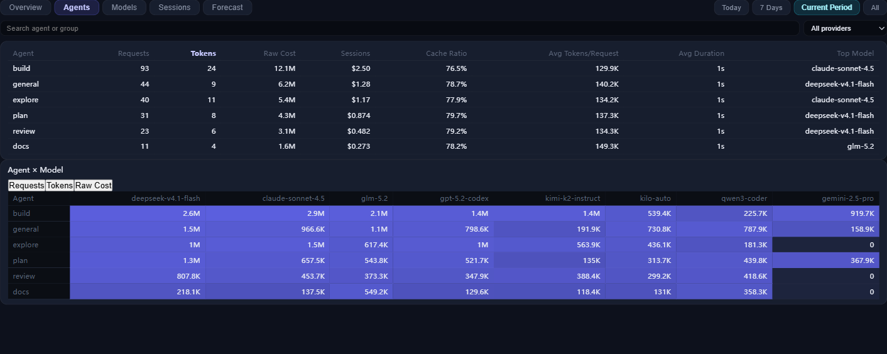
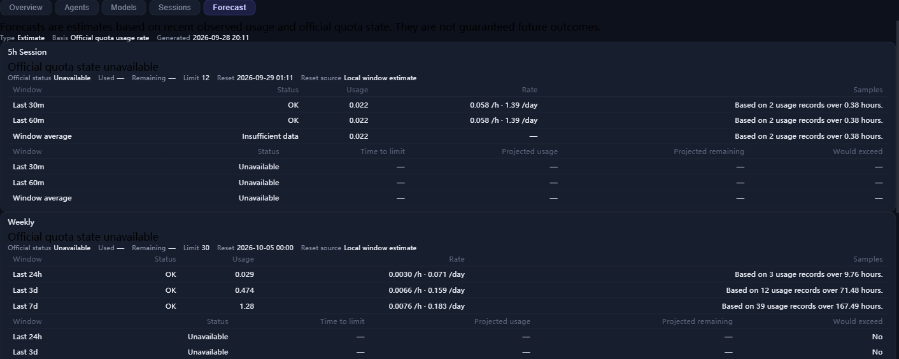

# OpenCode Widget

**A Windows desktop observability widget for OpenCode** — Agent / Model analytics, a usage
timeline, explainable quota forecasting, opt-in notifications, and a hardened localhost data
boundary.

面向 Windows 的 OpenCode 桌面用量与可观测性悬浮窗：Agent / Model 分析、用量趋势、额度预测、
桌面通知，以及加固的本地数据边界。


> [!NOTE]
> This project is a substantially modified fork of
> [ikunops/opencode-widget](https://github.com/ikunops/opencode-widget).
> Thanks to [@ikunops](https://github.com/ikunops) for the original project and codebase.
> See [UPSTREAM.md](UPSTREAM.md) for attribution and licensing notes.
>
> 本项目基于 [ikunops/opencode-widget](https://github.com/ikunops/opencode-widget)
> 进行大幅二次开发，感谢 [@ikunops](https://github.com/ikunops) 提供原始项目与代码基础。
> 上游来源及许可证说明见 [UPSTREAM.md](UPSTREAM.md)。
>
> This is an independent community project and is not affiliated with or endorsed by the OpenCode
> team. 本项目为独立社区项目，与 OpenCode 官方团队无隶属、赞助或背书关系。



## Features

- 📊 **Agent / Model observability** — per-agent, per-model, per-provider and per-session usage,
  token and cost breakdowns computed from your local OpenCode data.
- 📈 **Usage timeline** — day/hour bucketing plus a GitHub-style heatmap and an
  **Agent × Model** matrix.
- 🔮 **Explainable forecasting** — deterministic, reset-aware burn rates and time-to-limit
  estimates. Every output is labelled `estimate` and is never presented as official.
- 🔔 **Opt-in notifications** — forecast-aware alerts and a minimal tray menu. **Off by default.**
- 🪟 **Transparent Windows widget** — always-on mini status bar (default), quick-view card and
  full dashboard on demand, with drag-to-top snapping (see
  [`docs/COMPACT_FLOATING_UX.md`](docs/COMPACT_FLOATING_UX.md)).
- 🔒 **Hardened local security** — read-only OpenCode DB, an authenticated localhost API, and
  DPAPI-protected secrets (see [Security model](#security-model)).

## Screenshots

Screenshots are rendered from the current post-RC UI with **synthetic demo data** (no real account,
workspace, prompt or key material).

### Compact widget



### Agent × Model matrix



### Forecast



## What this fork adds

On top of the upstream usage-widget codebase, this fork adds:

- current OpenCode database-schema support (`session_message` / `session_v2`);
- Agent / Model / Provider / Session observability;
- a usage timeline and an **Agent × Model** visualization;
- deterministic, reset-aware usage forecasting;
- opt-in forecast-aware notifications and a minimal tray;
- desktop lifecycle hardening (single instance, server ownership, stale-runtime recovery);
- an authenticated localhost API and Windows DPAPI secret storage;
- official Go quota sync against the current OpenCode console (SPA) API;
- reproducible portable Windows packaging, versioned migrations and release sanitation.

See [UPSTREAM.md](UPSTREAM.md) for the full attribution and licensing note.

## Quick start

`v0.9.0-rc.1` is a **source** release candidate: the Git tag is public, but no compiled binary is
distributed (see [Binary availability](#binary-availability)). There are two ways to run it.

### Run from source

```bash
git clone https://github.com/Long-08/opencode-widget.git
cd opencode-widget

# 1) backend (Python 3.11+, standard library only)
python data_server.py

# 2) Electron shell (Node.js required for source runs)
cd electron
npm install
npm start
```

The backend listens on `127.0.0.1:8765` by default (override with `OPENCODE_WIDGET_PORT`).
On first launch it reads your local OpenCode database if present; if the database is missing or
uses an unsupported schema it shows a reader/empty state instead of failing.

### Local portable RC (not publicly distributed)

You can build the portable Windows folder locally from the tagged source:

```powershell
powershell -NoProfile -ExecutionPolicy Bypass -File scripts/build-release.ps1
```

This stages `dist/opencode-widget-0.9.0-rc.1/` and produces
`dist/opencode-widget-0.9.0-rc.1-win-x64.zip`. It requires system Python 3.11+ and an Electron
runtime installed under `electron/node_modules/`. Then run the launcher
`启动 OpenCode Widget.vbs` (recommended — no console flash) or `启动 OpenCode Widget.cmd`.

## Requirements

- **Windows 10 / 11** (x64).
- **Python 3.11+**, standard library only — no `pip install` is required at runtime.
- **Node.js** only for source runs or building from source. The packaged RC embeds Electron; end
  users do not install Node.

## Binary availability

A local Windows RC build exists, but compiled binaries are **not currently distributed publicly**
because the upstream repository does not establish explicit redistribution licensing. The source
tag is public; the artifact is not.

## Architecture

```text
OpenCode DB (read-only) ─┐
                         ▼
             Python local data service  (standard library only)
                         │  authenticated localhost API  (127.0.0.1, per-runtime token)
                         ▼
             Electron main process  (owns the runtime token)
                         │  narrow preload bridge  (no token, no generic fetch)
                         ▼
                     Renderer UI
```

Side paths (optional, never required to run): **official quota sync** (opt-in, uses your own auth
cookie) and the **remote cloud formula** (pure data, reported as `integrity_status: unsigned`).

The Python backend is started by the launcher; quitting through the normal path terminates it, and
a single instance is enforced.

## Security model

- The OpenCode database is opened **read-only** and is never modified.
- The localhost API requires a **per-run random runtime token** (`Authorization: Bearer`) plus
  **Host / Origin policy**; **CORS is never `*`**.
- The **renderer never receives the runtime token or the base URL**, and exposes no generic
  fetch / settings / notification capability.
- Sensitive credentials are protected with **Windows DPAPI** (`secrets.enc`, user-bound); new
  secret writes **fail closed** and never downgrade to plaintext.
- **Notifications are opt-in** and are never created without explicit user action.
- **Prompt / response content is not exposed** by the observability APIs.

Full details, including the remote-formula trust model and its scope limits, are documented in
[`docs/PHASE7_RELEASE_HARDENING.md`](docs/PHASE7_RELEASE_HARDENING.md).

## Forecast semantics

> Forecasts are estimates based on observed usage and available official quota state. They are not
> guaranteed predictions.

Every forecast row is labelled `estimate`; the widget never presents a forecast as an official
value.

## About “Raw Cost”

> Raw Cost reflects OpenCode message-record cost data and is not the same as official Go quota
> consumption.

Raw Cost is shown for transparency in the local analytics views. Official quota state (when you
opt in to sync) is tracked separately.

## Data, privacy and lifecycle

Mutable data lives in `%APPDATA%\opencode-widget\`:

| File | Contents |
|------|----------|
| `config.json` | non-secret configuration |
| `secrets.enc` | DPAPI-encrypted secrets (Windows user-bound) |
| `usage_remote.db` | official sync ledger mirror |
| `server_usage.db` | legacy official-data ledger mirror |
| `formula_cache.json` | last-known-good cloud formula |

- Only **local usage metadata** is processed, plus **official quota sync** when you opt in.
- The runtime token file is `%TEMP%\opencode-widget\runtime.json` (per-run token, port, pid).
- Legacy in-repo copies migrate into the data dir **once**; the originals are kept.
- **Upgrade:** replace the folder and keep `%APPDATA%\opencode-widget`; migrations are versioned
  and fail-safe. There is **no auto-updater**.
- **Uninstall:** delete the app folder. User data in `%APPDATA%\opencode-widget\` is kept unless
  you remove it manually.
- **Notifications are off by default**; notifications are not an audit log.

## Development

```bat
set TEMP=%LOCALAPPDATA%\Temp\opencode
set TMP=%TEMP%
python -m pytest -o addopts="" -q
```

**609 automated tests passing at the RC source tag `v0.9.0-rc.1`.** Tag provenance is checked by
`scripts/check_provenance.py` (asserts `HEAD == tag^{} == BUILD_INFO.commit`).

Git remotes for this fork:

```bash
git remote -v
# origin    https://github.com/Long-08/opencode-widget.git   (this fork)
# upstream  https://github.com/ikunops/opencode-widget.git   (original project)
```

## Upstream & attribution

This project is a substantially modified fork of
[ikunops/opencode-widget](https://github.com/ikunops/opencode-widget); the upstream Git history is
preserved. See [UPSTREAM.md](UPSTREAM.md) for the development base commit and full attribution.
Screenshot provenance is recorded there as well.

This is an independent community project and is not affiliated with or endorsed by the OpenCode
team.

## License status

The upstream repository did not include an explicit software license at the time of this fork, so
no new blanket license is asserted over upstream-derived code and **no `LICENSE` file is added**.
Compiled binary redistribution therefore waits until upstream licensing/permission is clarified.

## Release status

`v0.9.0-rc.1` is published as a **source** release candidate — a Git tag, not a stable release and
not a binary download. It is intended for validation before a stable release. See the
[`v0.9.0-rc.1` source tag](https://github.com/Long-08/opencode-widget/tree/v0.9.0-rc.1).

> `v0.9.0-rc.1` is **unsigned** (no Authenticode certificate), so Windows SmartScreen may warn when
> you run a local build. **Never use a script or workaround to bypass OS security warnings**; if you
> do not trust a build, do not run it.

---

## 中文

### 项目定位

面向 Windows 的 OpenCode 桌面用量与可观测性悬浮窗：**Agent / Model 分析、用量趋势、额度预测、
桌面通知**，以及加固的本地数据边界。

### 核心能力

- 📊 **Agent / Model 可观测性**：按 Agent / 模型 / 供应商 / 会话统计用量、Token 与费用。
- 📈 **用量趋势**：按天/小时聚合、GitHub 风格热力图，以及 **Agent × Model** 矩阵。
- 🔮 **可解释预测**：确定性的、感知重置的速率与“距耗尽时间”估算，全部标记为 `estimate`，
  绝不当作官方值。
- 🔔 **可选通知**：基于预测的提醒 + 最小托盘菜单，**默认关闭**。
- 🪟 **透明悬浮窗**：最小 Dock / 中窗 / 大屏三档，支持拖到顶部吸附。
- 🔒 **加固的本地安全**：只读数据库、需要运行时 token 的本机 API、DPAPI 机密保护。

### 截图

截图来自当前 RC 之后的界面，使用**合成演示数据**（不含真实账户、workspace、提示词或密钥）。

- 大屏仪表盘：`docs/assets/hero-dashboard.png`
- 最小悬浮窗：`docs/assets/compact-widget.png`
- Agent × Model 矩阵：`docs/assets/agent-model-matrix.png`
- 预测面板：`docs/assets/forecast-notification.png`

### 相对上游新增

在保留上游历史与归属的前提下，本 fork 增加了：当前 OpenCode 数据库 schema 支持
（`session_message` / `session_v2`）、Agent / Model / Provider / Session 可观测性、用量趋势与
Agent × Model 可视化、感知重置的用量预测、可选预测通知与最小托盘、单实例与生命周期加固、
需要 token 的本机 API 与 Windows DPAPI 机密存储、可复现的绿色版打包与版本化迁移 / 发布清洗。

### 快速开始

`v0.9.0-rc.1` 是**源码**发布候选：Git tag 公开，但**不公开分发编译好的二进制**。

源码运行：

```bash
git clone https://github.com/Long-08/opencode-widget.git
cd opencode-widget
python data_server.py          # 后端，Python 3.11+，仅标准库
cd electron && npm install && npm start   # Electron 外壳（源码运行需要 Node）
```

本地构建绿色版（不公开分发）：

```powershell
powershell -NoProfile -ExecutionPolicy Bypass -File scripts/build-release.ps1
```

构建后在 `dist/opencode-widget-0.9.0-rc.1/` 中运行 `启动 OpenCode Widget.vbs`。

### 环境要求

- **Windows 10 / 11**（x64）。
- **Python 3.11+**，仅标准库，运行时无需 `pip install`。
- **Node.js** 仅在源码运行或自行构建时需要；打包版已内置 Electron。

### 二进制可用性

本地已构建 Windows RC，但因上游未明确再分发许可，**当前不公开分发编译产物**。源码 tag 公开，
二进制不公开。

### 架构

```text
OpenCode 数据库（只读）
        │
        ▼
Python 本地数据服务（仅标准库）
        │  需要 token 的本机 API（127.0.0.1，每次运行随机 token）
        ▼
Electron 主进程（持有运行时 token）
        │  最小 preload 桥（不下发 token、无通用 fetch）
        ▼
渲染层 UI
```

旁路（可选，非运行必需）：**官方配额同步**（需用户开启，使用自己的 auth cookie）与**远程云端
公式**（纯数据，`integrity_status: unsigned`）。

### 安全模型

- OpenCode 数据库以**只读**方式打开，永不修改。
- 本机 API 需要**每次运行随机生成的 token** 与 **Host / Origin 策略**，**CORS 从不为 `*`**。
- **渲染进程拿不到运行时 token 和 base URL**，也没有通用 fetch / 设置 / 通知能力。
- 机密以 **Windows DPAPI**（用户绑定）保存，新写入**失败即关闭**，不降级明文。
- **通知默认关闭**，未获明确开启绝不创建。
- 可观测性 API **不暴露提示词 / 响应内容**。

详见 [`docs/PHASE7_RELEASE_HARDENING.md`](docs/PHASE7_RELEASE_HARDENING.md)。

### 预测语义

> 预测是基于已观测用量与可用官方配额状态的估算，**不保证**未来结果。

所有预测均标记为 `estimate`。

### 关于 “Raw Cost”

> Raw Cost 反映 OpenCode 消息记录中的费用数据，**不等同于官方 Go 配额消耗**。

### 数据与生命周期

可变数据位于 `%APPDATA%\opencode-widget\`（配置、DPAPI 机密、官方同步账本、云端公式缓存）。
运行时 token 文件为 `%TEMP%\opencode-widget\runtime.json`。升级用新版本覆盖并保留
`%APPDATA%\opencode-widget`；迁移分版本、失败安全；无自动更新器。卸载删除应用目录即可，用户
数据默认保留。

### 开发与上游

```bat
set TEMP=%LOCALAPPDATA%\Temp\opencode
set TMP=%TEMP%
python -m pytest -o addopts="" -q
```

**`v0.9.0-rc.1` 源码 tag 处 609 项测试全部通过。**

```bash
git remote -v
# origin    https://github.com/Long-08/opencode-widget.git   （本 fork）
# upstream  https://github.com/ikunops/opencode-widget.git   （上游原项目）
```

本项目基于 [ikunops/opencode-widget](https://github.com/ikunops/opencode-widget) 进行大幅二次
开发，并保留上游 Git 历史；完整归属与开发基点见 [UPSTREAM.md](UPSTREAM.md)。

本项目为独立社区项目，与 OpenCode 官方团队无隶属、赞助或背书关系。

### 许可证状态

上游仓库在本 fork 创建时未包含明确的软件许可证，因此本仓库不对上游衍生的代码主张新的整体开源
许可，也**不添加 `LICENSE` 文件**。编译产物的再分发需待上游明确许可 / 授权后再考虑。

### 发布状态

`v0.9.0-rc.1` 以**源码**发布候选发布（仅 Git tag，非稳定版、非二进制下载），用于稳定版之前的
验证。tag 页面：
[`v0.9.0-rc.1`](https://github.com/Long-08/opencode-widget/tree/v0.9.0-rc.1)。

> `v0.9.0-rc.1` **未签名**（无 Authenticode 证书），本地运行时 SmartScreen 可能提示。
> **不要使用任何脚本或手段绕过系统安全警告**；若不信任构建，请不要运行。
